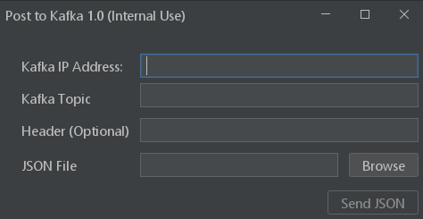

# Kafka Tools - Post JSON to Kafka
### Tool to easily post a json file to Kafka using a select file tool

An all-in-one kafka tool written in `Java` to easly post json files to kafka

# Features 
## v1.0

* Post Json to kafka
* Include header (format key=value)
* Add topics

# Requirements  
* [`Java 1.8.0 or newer`](https://www.java.com/download) : Java 1.8.0 or newer

# Screenshots

# This tool is tested on
-  ✅ Windows 10 & 11

# Developer
**Bernabe Soto** - [@bernabesc](https://github.com/bernabesc/)
